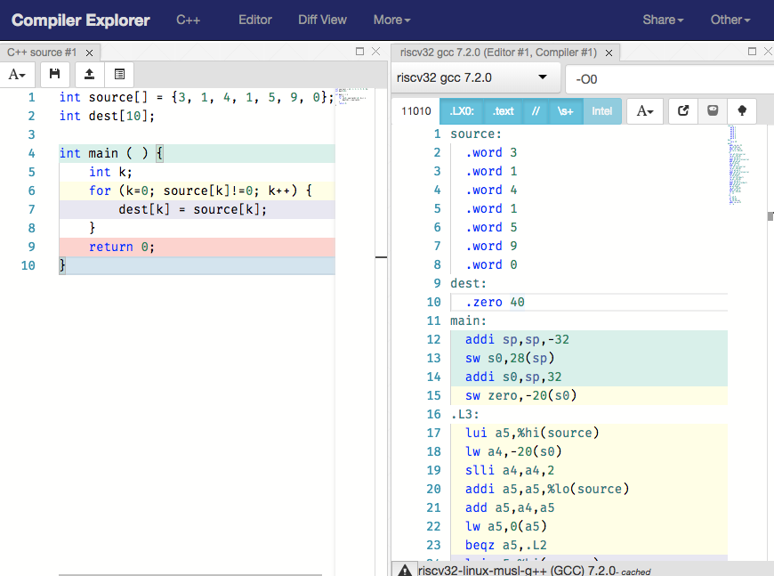

Intro to RISC-V
---

Feedback about the section (Google Form)
https://goo.gl/HYyVv3

----

### Tools

In Lab 3, you are introduced to Venus: http://www.kvakil.me/venus/. Venus is
easy to use but somewhat limited (it is meant for education anyway).

In addition to Venus, you can setup your own RISC-V toolchain to explore the
compiler.

https://github.com/riscv/riscv-tools

---

If compiling code from source is hard for you, you can use this compiler explorer:
https://cx.rv8.io/



---
### Optimization Levels

Level 0: `-O0`

```c
void x() {
}
```

```assembly
x():
  addi sp,sp,-16
  sw s0,12(sp)
  addi s0,sp,16
  nop
  lw s0,12(sp)
  addi sp,sp,16
  jr ra
```

Level 1/2/3: `-O1`, `-O2`, `-O3`.

```c
void x() {
}
```

```assembly
x():
  ret
```

### Simple Functions

```c
int double_(int x) {
    return x + x;
}
```

```assembly
double_(int):
  slli a0,a0,1
  ret
```

```assembly
double_(int):
  add a0,a0,a0
  jr ra
```

#### More

Use compiler explorer.

```c
int ultimate_question(int a0, int a1, int a2, int a3,
                      int a4, int a5, int a6, int a7,
                      int a8, int a9) {
    int x = a0 + a1 + a2 + a3 + a4 + a5 + a6 + a7 + a8 + a9;
    return x;
}

int main() {
    return ultimate_question(0, 1, 2, 3, 4, 5, 6, 7, 8, 9);
}
```

#### 1. Overview

1. Range using Branch (12 bits, [-2^12, 2^12 - 1] bytes, [-2^10, 2^10 - 1] instructions)
2. Range using Jump (20 bits, [-2^20, 2^20 - 1] bytes, [-2^18, 2^18 - 1] instructions)
3. Assembly

```
0x002cff00: loop: add t1, t2, t0      #R  | 0        |  5   | 7  |   0   |     6   | 0x33 |
0x002cff04:       jal ra, foo         #J  | 0        | 0x14 | 0  |   0   |     1   | 0x6F |
0x002cff08:       bne t1, zero, loop  #B  | 1 | 0x3F | 0    | 6  |   1   | 0xC | 1 | 0x63 |
...
0x002cff2c: foo:  jr ra                  ra=__0x002cff08___
```


#### 2. Powerful RISC-V

Write assembly friendly C.

```c
int power(int x, int n) {
    int ret = 1;
    for (int i = 0; i < n; i++) {
        ret = ret * x;
    }
    return ret;
}
```

```c
int power(int a0 /* x */, int a1 /* n */) {
    int t0 = 0;
    int t1 = a0;
    int a0 = 1;
    while (!(t0 >= a1)) {
        a0 = a0 * t1;
        t0++;
    }
    return a0;
}
```

```assembly
power: li   t0, 0       # t0 = 0
       addi t1, a0, 0   # t1 = a0
       addi a0, x0, 1   # a0 = 1
loop:  bge  t0, a1, end # end the loop if t0 >= a1 (n)
       mul  a0, a0, t1  # a0 = a0 * t1
       addi t0, t0, 1   # t0 = t0 + 1
       jal  x0, loop    # Jump back to the while condition
end:   jr ra            # Return to caller
```

#### Assembler / Linker / Loader / Go

Use examples in [multifiles](multifiles).

```
.
├── Makefile
├── add.c
├── add.h
├── main.c
├── mul.c
├── mul.h
├── sub.c
└── sub.h
```

```make
# CC=gcc -O0
# AR=ar
CC=/opt/riscv/toolchain/bin/riscv64-unknown-elf-gcc
AR=/opt/riscv/toolchain/bin/riscv64-unknown-elf-ar
```

```c
// add.h
int add(int a, int b);

// add.c
int add(int a, int b) {
    return a + b;
}
```

```c
// main.c
#include <stdio.h>

#include "add.h"
#include "sub.h"
#include "mul.h"

int main() {
    printf("1 + 1 = %d\n", add(1, 1));
    printf("2 - 1 = %d\n", sub(2, 1));
    printf("2 * 1 = %d\n", mul(2, 1));
    return 0;
}
```

```
$ rv-bin dump -a add.o
$ rv-sim main
```

--------------

### RISC-V Functions sum(i ^ 2)

When you see nested calls, push important registers (`ra`, `s0`, `s1`) onto the
stack.

```c
int sumSquare(int a0) {
    int s0 = a0;
    int s1 = 0;
    while (!(s0 <= 0) /* s0 > 0 */) {
        int a0 = s0;
        int a0 = square(a0);
        s1 += a0;
        s0--;
    }
    return s0;
}
```

``` assembly
sumSquare: addi sp, sp -12  # Make space for `ra`, `s0`, `s1`
           sw   ra, 0(sp)   # Store the return address
           sw   s0, 4(sp)   # Store register s0
           sw   s1, 8(sp)   # Store register s1
           add  s0, a0, x0  # s0 = a0
           add  s1, x0, x0  # s1 = 0
     loop: bge  x0, s0, end # branch if s0 <= 0
           add  a0, s0, x0  # a0 = s0
           jal  ra, square  # call sqaure
           add  s1, s1, a0  # s1 += a0
           addi s0, s0, -1  # s0--
           jal  x0, loop    # Jump back to the loop label
      end: add  a0, s1, x0  # Set a0 to s1, which is the desired return value
           lw   ra, 0(sp)   # Restore ra
           lw   s0, 4(sp)   # Restore s0
           lw   s1, 8(sp)   # Restore s1
           addi sp, sp, 12  # Free space on the stack for the 3 words
           jr   ra          # Return to the caller
```


- [C](c.md)
- [RISC-V](riscv.md)
