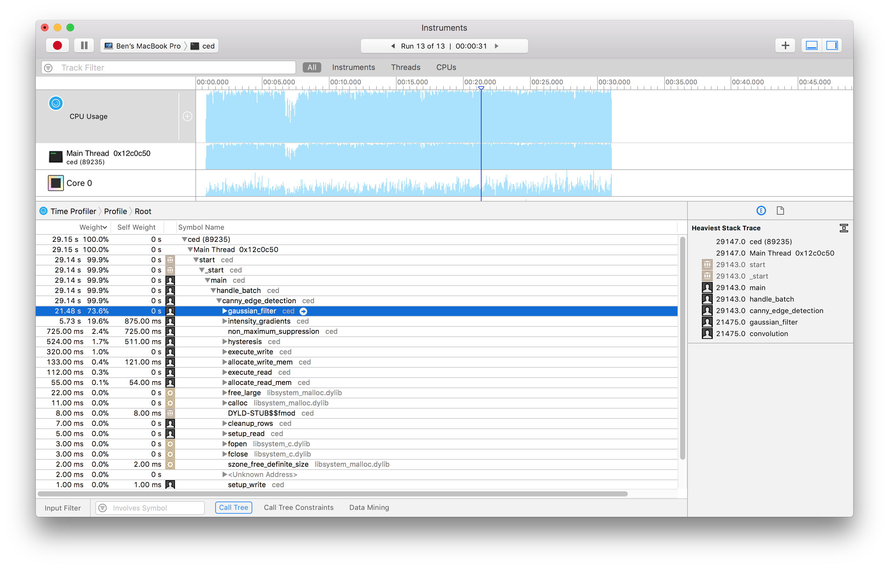
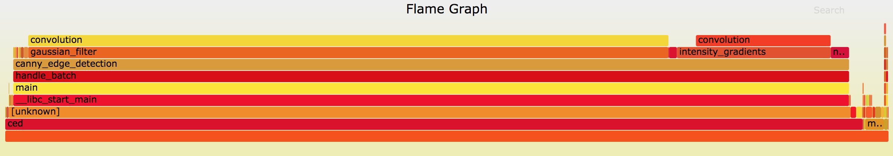

Performance Measurement
---

## gprof

1. When compiling, do `gcc -pg`. That is, modify the compiler flag to `-pg`.
2. Run the program: `./ced -b ../input/*.png`
3. gprof will generate a gmon.out file (you can check with `ls`)
4. get stats, e.g. `gprof ced gmon.out` and you will see the following table.

```
Each sample counts as 0.01 seconds.
  %   cumulative   self              self     total
 time   seconds   seconds    calls  ms/call  ms/call  name
 96.50      0.54     0.54        3   180.13   180.13  convolution
  1.79      0.55     0.01        1    10.01   370.27  intensity_gradients
  1.79      0.56     0.01        1    10.01    10.01  non_maximum_suppression
  0.00      0.56     0.00        1     0.00     0.00  allocate_read_mem
  0.00      0.56     0.00        1     0.00     0.00  allocate_write_mem
  0.00      0.56     0.00        1     0.00   560.41  canny_edge_detection
  0.00      0.56     0.00        1     0.00     0.00  cleanup_rows
  0.00      0.56     0.00        1     0.00     0.00  cleanup_struct_mem
  0.00      0.56     0.00        1     0.00     0.00  execute_read
  0.00      0.56     0.00        1     0.00     0.00  execute_write
  0.00      0.56     0.00        1     0.00   180.13  gaussian_filter
  0.00      0.56     0.00        1     0.00   560.41  handle_batch
  0.00      0.56     0.00        1     0.00     0.00  hysteresis
  0.00      0.56     0.00        1     0.00     0.00  setup_info
  0.00      0.56     0.00        1     0.00     0.00  setup_read
  0.00      0.56     0.00        1     0.00     0.00  setup_write
```

## Using XCode Instrumentation

1. Open `Instruments.app`
2. Select `Time Profiler`
3. Click top left corner to select target
   1. select `ced` in your student folder
   2. make sure to modify the argument (`../input/baboon.png ../input/bowtie.png	../input/dollar.png	../input/night.png	../input/silver.png	../input/sword.png ../input/balloons.png	../input/c.png		../input/flag.png	../input/ocean.png	../input/smile.png	../input/tree.png ../input/bigbrain.png	../input/chair.png	../input/guitar.png	../input/oski.png	../input/snorlax.png	../input/valve.png ../input/bird.png	../input/darkknight.png	../input/house.png	../input/playground.png	../input/square.png	../input/wallet.png ../input/bottle.png	../input/darknight.png	../input/knight.png	../input/rainbow.png	../input/stool.png	../input/weaver.png`)
   3. set working directory to the student folder in the project directory
4. Click the top left record corner and you will get the following graph




## perf + FlameGraph

Only on Linux.




```sh
# Install FlameGraph (remember to use the correct path)
$ git clone https://github.com/brendangregg/FlameGraph
$ export PATH=$PATH:<Path to FlameGraph repo>
$ cd <student folder>
$ perf record -F 100 -a -g -- ./ced -b ../input/*.png
$ perf script | stackcollapse-perf.pl > out.perf-folded
$ flamegraph.pl out.perf-folded > perf.svg
$ # Now you can open perf.svg in the browser
```
